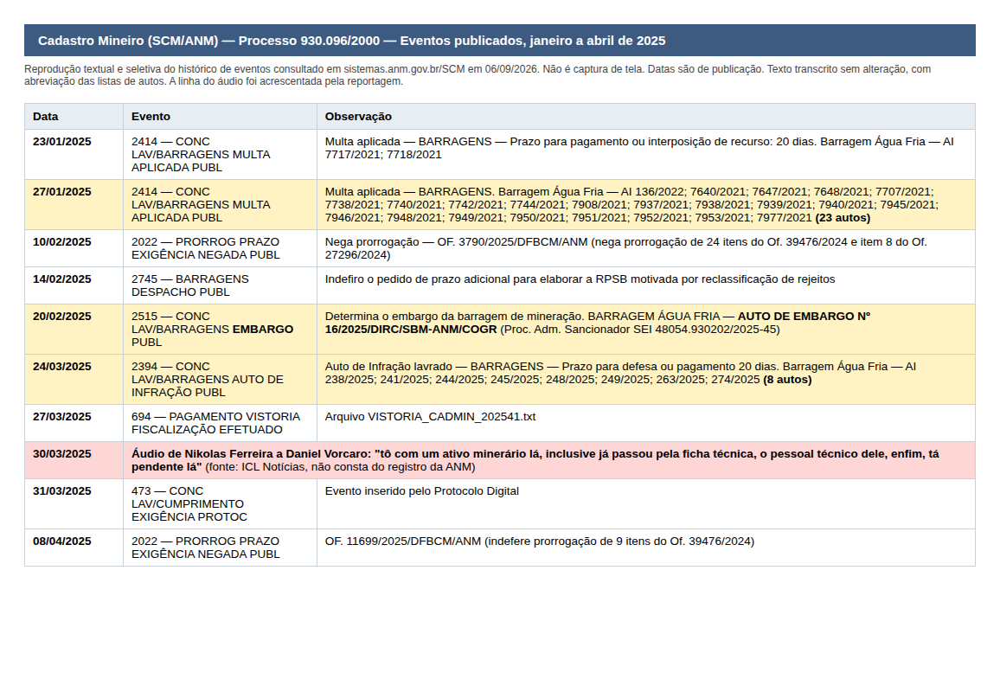
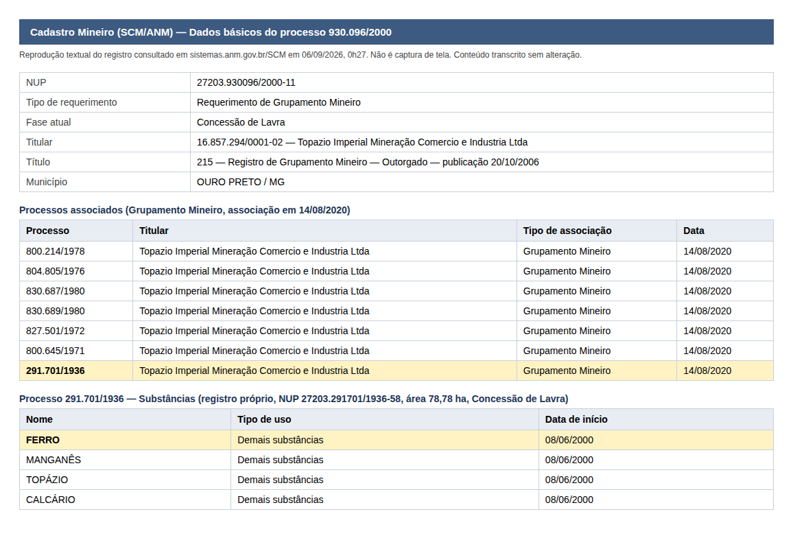

# O ativo que Nikolas levou a Vorcaro estava embargado, multado e nas mãos de um funcionário do seu gabinete

**O Cadastro Mineiro da ANM mostra que a barragem da Topázio Imperial recebeu 23 multas em janeiro de 2025, embargo em fevereiro e oito autos de infração seis dias antes do áudio. O advogado que negociava a lavra era secretário parlamentar de Nikolas e recebia R$ 17 mil por mês da Câmara. O grupamento inclui uma concessão de ferro.**

*Por Miguel do Rosário. Versão 3, 06/09/2026. Rascunho de trabalho. Não publicado. Pedidos de manifestação ainda não enviados.*

*O deputado Nikolas Ferreira (PL-MG) em audiência pública na Câmara, 21 de maio de 2025. Foto de Kayo Magalhães, Câmara dos Deputados, CC BY 3.0*

---

Em 30 de março de 2025, Nikolas Ferreira mandou um áudio a Daniel Vorcaro. O deputado pedia ajuda para um "ativo minerário" de seu advogado, que "já passou pela ficha técnica" e estava "pendente".

Seis dias antes, a Agência Nacional de Mineração havia publicado oito autos de infração contra a barragem Água Fria, da Topázio Imperial. Trinta e oito dias antes, a mesma agência havia embargado a barragem. Dois meses antes, no mês em que o advogado assinou seu contrato para vender a lavra, a ANM tinha aplicado multas em 23 autos de infração da empresa.

O advogado se chama Thiago Rodrigues de Faria. Nikolas o apresenta como "ex-assessor". Os registros da Câmara mostram que naquele março ele era secretário parlamentar do gabinete, com R$ 17.273,26 de salário e R$ 2.747,71 de auxílios.

O Cafezinho reconstruiu essa cronologia a partir de quatro fontes públicas que a cobertura do caso ainda não tinha cruzado. O Portal da Transparência da Câmara. A base de dados abertos do CNPJ da Receita Federal. O Cadastro Mineiro da ANM. E as pautas e certidões da diretoria da agência.

## O que estava "pendente"

O áudio de Nikolas não diz o nome do ativo. O inquérito da Operação Rejeito, citado pelo Estado de Minas em setembro de 2025, diz. Os investigados negociavam o processo ANM 930.096/2000, um grupamento mineiro da Topázio Imperial em Rodrigo Silva, distrito de Ouro Preto.

O histórico desse processo no Cadastro Mineiro, consultado pela equipe do Cafezinho em 6 de setembro, registra o que a agência fazia com a empresa nos meses anteriores ao áudio.

Em 23 e 27 de janeiro de 2025, a ANM negou as defesas da Topázio e aplicou multas em 25 autos de infração da barragem Água Fria, lavrados em 2021 e 2022. Foi nesse mês que o escritório de Faria assinou o contrato com a Gmais Ambiental para intermediar a venda da lavra.

Em 10 de fevereiro, a agência negou a prorrogação de 25 itens de exigências técnicas. Em 14 de fevereiro, indeferiu pedido de prazo adicional para a revisão de segurança da barragem.

Em 20 de fevereiro, a ANM publicou o Auto de Embargo 16/2025 contra a Água Fria.

Em 24 de março, publicou oito novos autos de infração, com prazo de 20 dias para defesa ou pagamento.

Em 30 de março, Nikolas gravou o áudio.

*Histórico do processo 930.096/2000 no Cadastro Mineiro da ANM entre janeiro e abril de 2025. Reprodução textual do registro consultado em 6 de setembro de 2026. A linha do áudio foi acrescentada pela reportagem*

Os registros mostram datas de publicação, não de lavratura. Não provam que Nikolas soubesse de cada auto, nem que o pedido ao banqueiro visasse a ANM. O que provam é o estado do ativo no dia em que o deputado disse que ele estava "pendente".

A fiscalização não parou depois. Em 3 de julho de 2025, segundo embargo, Auto 59/2025. Em 16 de setembro, véspera da Operação Rejeito, mais três autos de infração. Em 10 de abril de 2026, terceiro embargo, Auto 13/2026, publicado no Diário Oficial da União.

*Diário Oficial da União de 10 de abril de 2026, Seção 1, página 59. Reprodução*

A Água Fria acumula 2 milhões de metros cúbicos de rejeito e foi construída pelo método a montante, o mesmo de Mariana e Brumadinho. O Ministério Público Federal a listou entre as sete barragens de maior risco de rompimento do país e obteve na Justiça, segundo a PF, tutela de urgência que suspendeu o empreendimento.

## Um funcionário público no meio do negócio

Faria tomou posse no gabinete de Nikolas em 9 de março de 2023, como secretário parlamentar nível SP24. Ficou até 30 de março de 2026, sem interrupção.

Em janeiro de 2025, quando o escritório dele assinou o contrato com a Gmais, seu salário na Câmara era de R$ 16.275,56. O acordo, revelado pelo Estado de Minas a partir do inquérito, previa comissão de 20% sobre um negócio de US$ 30 a 45 milhões, dividida entre a Gmais, o escritório de Faria e uma contabilidade chamada Estabil. A parte do advogado poderia chegar a US$ 2,25 milhões.

Em março de 2025, mês do áudio, o salário tinha subido para R$ 17.273,26.

*Ficha de Thiago Rodrigues de Faria em março de 2025, mês do áudio. Reprodução do Portal da Transparência da Câmara dos Deputados*

Em setembro de 2025, quando a Polícia Federal prendeu Rodrigo de Melo Teixeira e Gilberto Horta de Carvalho, apontados como gestores ocultos da Gmais, e o nome de Faria apareceu no inquérito, ele seguia na folha. Continuou por mais seis meses.

Ao longo de 37 competências, entre março de 2023 e março de 2026, o gabinete pagou a Faria R$ 709.424,03 em cargo, adicional de férias e auxílios. A soma, conferida em planilha reproduzível, não inclui o 13º salário, lançado em folha separada.

Faria deixou o gabinete em 30 de março de 2026. Vinte e cinco dias antes, a PF havia entregue à CPMI do INSS a agenda de contatos de Vorcaro, com o nome de Nikolas e o de seu ex-chefe de gabinete Pablo Almeida. O Cafezinho não afirma relação de causa entre as duas datas. Registra a sequência.

## A empresa que nasceu dentro do gabinete

Em setembro de 2025, ao Estado de Minas, Nikolas disse que Faria "atua regularmente como advogado, com escritório registrado, e não há qualquer impedimento jurídico". A base da Receita Federal mostra quando esse registro aconteceu.

A Thiago Rodrigues Sociedade Individual de Advocacia, CNPJ 56.902.629/0001-81, foi aberta em 19 de agosto de 2024, com sede em Nova Lima e capital de R$ 100 mil. Faria era, naquele mês, secretário parlamentar havia um ano e meio.

A data fica entre dois marcos do inquérito. Em abril de 2024, segundo a PF, Faria e Horta criaram um grupo de WhatsApp chamado "Projeto Ferro" para tratar da transação. Em janeiro de 2025 o escritório recém-aberto assinou o contrato com a Gmais.

O Estatuto da Advocacia permite que advogado servidor tenha sociedade unipessoal, desde que não esteja em regime de dedicação exclusiva. A existência do escritório, por si, não configura infração. O que a lei não responde é se um secretário parlamentar pode firmar contrato de êxito para intermediar a venda de direitos minerários e receber comissão milionária por isso. Essa é uma das perguntas que o Cafezinho vai encaminhar ao gabinete e à Câmara.

## Que mina é essa

O nome da empresa levou a cobertura a tratar o negócio como uma lavra de topázio, a gema que deu fama a Ouro Preto. O Cadastro Mineiro conta uma história mais complexa.

O grupamento 930.096/2000 reúne sete concessões de lavra da Topázio Imperial, com 725 hectares somados. Seis são de topázio e gemas. A sétima, processo 291.701/1936, tem 78,78 hectares e quatro substâncias registradas, nesta ordem. Ferro, manganês, topázio e calcário.

*Composição do grupamento 930.096/2000 e substâncias do processo 291.701/1936. Reprodução textual dos registros do Cadastro Mineiro da ANM consultados em 6 de setembro de 2026*

Um boletim da FIPE de outubro de 2021, baseado no Diagnóstico do Setor Mineral de Minas Gerais e no SIGMINE, lista os "principais titulares de grupamento mineiro por substâncias metálicas em Minas Gerais, ferro". São nove empresas. Vale, MBR, Gerdau Açominas, Samarco, Usiminas e, com um grupamento, a Topázio Imperial.

*Tabela do boletim Informações FIPE de outubro de 2021. Reprodução*

A ordem das substâncias no cadastro não prova que o ferro seja o mineral predominante nem o objeto econômico da venda. Prova que ele está lá, dentro do grupamento que o grupo da Gmais discutia num chat chamado "Projeto Ferro".

Se o ferro era o objeto, o negócio de US$ 45 milhões deixa de ser uma gema e passa a ser o mesmo minério que move a Serra do Curral, a Vale e toda a Operação Rejeito.

## O administrador que chegou no meio do caminho

Gilberto Horta não era estranho a Nikolas. Em 2023 o deputado gravou vídeo pedindo votos para ele no CREA-MG. Em janeiro de 2025, segundo o Metrópoles, os dois estiveram na posse de Donald Trump.

A base da Receita mostra Horta como administrador da Gmais Ambiental com entrada em 18 de fevereiro de 2025. Um mês depois do contrato com Faria. Dois dias antes do embargo da Água Fria. Seis semanas antes do áudio.

No mesmo mês Horta assumiu cargo de assessor do vereador Uner Augusto (PL), aliado de Nikolas em Belo Horizonte, onde ficou até ser preso em setembro. A ficha cadastral não reconstitui saídas e retornos anteriores. O que ela mostra é quem respondia formalmente pela Gmais quando o deputado ligou para o banqueiro.

## O regulador

Em 26 de dezembro de 2025, três meses após a Operação Rejeito, a Secretaria-Geral da ANM distribuiu 41 recursos da Topázio Imperial contra multas de barragem. Todos foram para o mesmo relator, o diretor-geral da agência, Mauro Henrique Moreira Sousa. Em agosto de 2026, a pauta da 88ª reunião da diretoria colegiada listava 90 recursos da empresa, todos no bloco de Sousa.

*Pauta da 88ª reunião da diretoria colegiada da ANM, 19 de agosto de 2026. Reprodução do SEI da ANM*

Em junho de 2026, a Polícia Federal indiciou Sousa por advocacia administrativa e associação criminosa no relatório final da Operação Parcours, investigação conectada à Rejeito e relativa à Serra do Curral. A ANM afirmou que ele atuou "exclusivamente como representante institucional". Sousa continua no cargo.

Não há nos documentos decisão sobre os recursos da Topázio, nem menção a Faria, Nikolas, Gmais ou Banco Master. O que os papéis mostram é o ambiente em que o "destravamento" pedido no áudio seria decidido.

## As defesas

*[Espaço reservado. Perguntas a Nikolas Ferreira, Thiago Rodrigues de Faria, Gmais Ambiental, Topázio Imperial, Estabil, ANM e Câmara dos Deputados ainda não foram enviadas. Registrar aqui destinatário, canal, data, prazo e resposta antes de publicar.]*

Em manifestações anteriores, Nikolas afirmou que apenas fez "uma ponte" para um amigo, que não sabia "do que se tratava" e que nunca recebeu dinheiro de Vorcaro. Depois da publicação de A Investigação, disse ao site que "o meu advogado queria vender a terra, sei lá o que que era, para o Vorcaro" e que "não houve nada de liberação".

Faria disse ao ICL que trabalha na área de mineração, que "mandou um ativo minerário pra todo mundo" e que nunca foi chamado a depor. Ele não foi indiciado no relatório final da Rejeito.

Vorcaro, por meio da defesa, não se manifesta.

---

Nikolas e Faria têm razão em um ponto. Faria é mesmo um ex-assessor. Desde 30 de março de 2026.

---

**Categoria:** Política. **Autor:** Miguel do Rosário. **Tags:** Nikolas Ferreira, Daniel Vorcaro, Thiago Rodrigues de Faria, Banco Master, Operação Rejeito, Mineração, ANM

---

## Nota de apuração (não publicar)

**O que mudou da versão 2 para a 3.** A rodada ZM/GPT obteve os registros do Cadastro Mineiro dos processos 930.096/2000 e 291.701/1936. Isso fechou duas pendências (composição do grupamento e presença de ferro) e abriu a frente mais forte da matéria, a cronologia da ANM em 2025. A leitura integral do histórico pelo Fable acrescentou ao que o GPT destacou: as multas de 23 e 27 de janeiro de 2025 (25 autos, mês do contrato), a negativa em massa de prorrogações em 10 de fevereiro, o segundo embargo de 3 de julho de 2025 e os três autos de 16 de setembro de 2025.

**Tese.** A tese central (funcionário público no negócio) permanece. A tese complementar (ferro) saiu de hipótese para fato cadastral com limite explícito. A novidade é que o título agora se ancora no que estava "pendente": o registro da ANM dá ao áudio um contexto que a cobertura não tinha. Recomenda-se abrir por aí.

**Fontes primárias.** Portal da Câmara (ficha Rw29VM35KZe6WyY8yEb4 e histórico funcional em camara.leg.br/deputados/209787/pessoal-gabinete). Receita Federal, dados abertos do CNPJ via espelho minhareceita.org (06/09/2026). SCM/ANM, registros textuais em `fontes-zm-2026-09-06/` (captura 06/09/2026, 0h27 e 0h29). Certidão SG-ANM 53/2025. Pauta da 88ª ROP (SEI 20613489). DOU 10/04/2026 S1 p. 59 (autenticação informada pela ZM, PDF oficial ainda não preservado). FIPE bif493 out/2021.

**Imagens.** As duas imagens `repro-anm-scm-*.png` são reproduções tipográficas dos registros textuais, produzidas pela reportagem porque o SCM devolvia erro 503 a este ambiente e o print obtido pela ZM saiu corrompido. Estão identificadas como reprodução, não como captura de tela. Se o SCM voltar, substituir por captura real.

**Limites já incorporados no texto.** Datas do SCM são de publicação. "Empresa de fachada" é conclusão da PF. Horta "consta como administrador desde". Ferro presente, não predominante. Mauro Sousa indiciado na Parcours. Nenhuma afirmação de que o Cafezinho já procurou alguém. O total de R$ 709.424,03 exclui 13º e a parcela eventual de R$ 598,80 de março de 2026.

**Antes de publicar.** (1) Enviar perguntas, 48h. (2) Preservar o PDF oficial do DOU. (3) Obter o Auto de Embargo 16/2025 e os oito autos de 24/03/2025 no SEI da ANM. (4) Decisão de tutela da ACP 1000752-23.2023.4.06.3822. (5) JUCEMG da Gmais. (6) TSE, se render.
