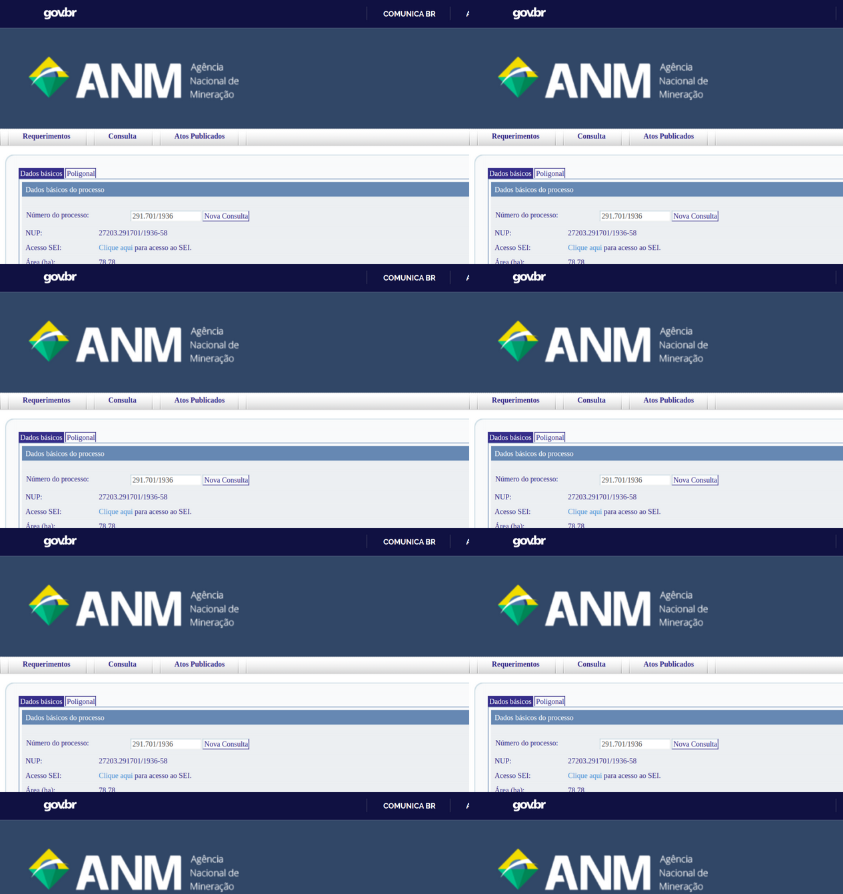

# Assessor de Nikolas tinha contrato minerário enquanto recebia da Câmara

**Registros da ANM mostram que o grupamento da Topázio Imperial inclui uma concessão com ferro entre quatro substâncias. A barragem da empresa teve embargo publicado 38 dias antes do áudio do deputado a Vorcaro.**

*Por Miguel do Rosário. Rascunho revisto em 06/09/2026. Não liberado para publicação. Pedidos de manifestação ainda não enviados.*

Quando Nikolas Ferreira pediu a Daniel Vorcaro ajuda para um ativo minerário de Thiago Rodrigues de Faria, em 30 de março de 2025, o advogado ainda trabalhava no gabinete do deputado. Naquele mês, sua remuneração na Câmara incluía R$ 17.273,26 pelo cargo e R$ 2.747,71 em auxílios.

O [histórico funcional da Câmara](https://www.camara.leg.br/deputados/209787/pessoal-gabinete) registra o vínculo de Faria de 9 de março de 2023 a 30 de março de 2026. Ele permaneceu no gabinete durante o contrato com a Gmais Ambiental noticiado pela imprensa, o áudio ao banqueiro e a deflagração da Operação Rejeito.

Documentos reunidos pelo Cafezinho também esclarecem a composição do grupamento minerário da Topázio Imperial, empresa cujos direitos eram negociados pelo grupo ligado à Gmais, segundo reportagens sobre o inquérito. O cadastro inclui um processo com ferro, manganês, topázio e calcário, além de registrar medidas contra a barragem Água Fria antes e depois do áudio.

Esses documentos não identificam, por si, o ativo apresentado a Vorcaro. O áudio não menciona a Topázio pelo nome, e a relação entre o negócio do contrato e a proposta levada ao banqueiro ainda depende de comprovação documental.

## O contrato e a folha

Segundo o [Estado de Minas](https://www.em.com.br/politica/2025/09/7258290-assessor-de-nikolas-tinha-negocios-com-empresa-investigada-pela-pf.html), o escritório de Faria assinou um contrato de intermediação com a Gmais em janeiro de 2025. O jornal revelou o acordo a partir do inquérito da Operação Rejeito.

Os termos detalhados por [A Investigação](https://www.ainvestigacao.com/p/audio-de-nikolas-a-vorcaro-confirma) previam comissão global de 20% sobre uma operação estimada entre US$ 30 milhões e US$ 45 milhões. Metade da comissão caberia à Gmais, enquanto o escritório de Faria e a Estabil receberiam 25% cada.

A participação prevista para o advogado equivalia, portanto, a 5% do negócio, podendo chegar a US$ 2,25 milhões. Não foi obtido comprovante de pagamento dessa comissão.

No mês da assinatura, Faria tinha R$ 16.275,56 registrados na rubrica do cargo. Em março, quando Nikolas enviou a mensagem divulgada pelo [ICL Notícias](https://iclnoticias.com.br/nikolas-vorcaro-lindao-minerio-master/), o valor havia passado a R$ 17.273,26.

*Remuneração de Thiago Rodrigues de Faria no mês do áudio. Reprodução do Portal da Transparência da Câmara dos Deputados.*

Em setembro de 2025, quando a PF deflagrou a Operação Rejeito, o advogado continuava na folha, com R$ 17.273,26 pelo cargo e R$ 3.014,31 de auxílios. Ele permaneceu no gabinete por mais seis meses.

A soma das rubricas de cargo, adicional de férias e auxílios nas 37 competências entre março de 2023 e março de 2026 chega a R$ 709.424,03. O cálculo, reproduzido no [CSV da apuração](folha-camara-thiago-rodrigues-de-faria.csv), não inclui a folha separada do 13º nem as verbas eventuais que ficaram fora da planilha.

O histórico funcional informa que Faria passou de SP24 para SP22 em 18 de fevereiro de 2026. Na competência de março, o levantamento registra R$ 18.655,12 pelo cargo e R$ 3.144,94 de auxílios, além de R$ 598,80 em verbas eventuais apontados na conferência da equipe.

## O escritório aberto durante o vínculo

A consulta aos dados cadastrais do CNPJ, reunida pela reportagem por meio do espelho minhareceita.org, aponta a abertura da Thiago Rodrigues Sociedade Individual de Advocacia em 19 de agosto de 2024. O escritório tem CNPJ 56.902.629/0001-81, sede em Nova Lima e capital declarado de R$ 100 mil, com Faria como titular.

A data situa a abertura da sociedade durante o vínculo com a Câmara. Ela também fica entre a criação do grupo de WhatsApp denominado Projeto Ferro, em abril de 2024, segundo a [apuração de A Investigação sobre o inquérito](https://www.ainvestigacao.com/p/audio-de-nikolas-a-vorcaro-confirma), e o contrato noticiado em janeiro de 2025.

A existência do escritório não demonstra, isoladamente, infração funcional. O [Estatuto da Advocacia](https://www.planalto.gov.br/ccivil_03/leis/l8906.htm) admite advogado servidor como administrador de sociedade de advogados quando não submetido à dedicação exclusiva.

A apuração precisa distinguir serviços jurídicos de intermediação comercial e verificar a compatibilidade das atividades com as atribuições do cargo. Os registros examinados não permitem concluir que Faria tenha descumprido a jornada ou utilizado recursos públicos no negócio.

## Que mina é essa

Uma reportagem do [Estado de Minas de 18 de setembro de 2025](https://www.em.com.br/gerais/2025/09/7251270-dialogo-indica-que-organizacao-criminosa-ignorou-risco-critico-de-barragem.html) identifica o processo ANM 930.096/2000 nas conversas sobre a Topázio Imperial. Segundo os trechos do inquérito publicados pelo jornal, Horta e João Alberto Paixão Lages trocaram registros desse processo em fevereiro de 2023.

A consulta ao Cadastro Mineiro da ANM, preservada pela equipe em 6 de setembro de 2026, identifica esse número como um grupamento da Topázio Imperial Mineração Comércio e Indústria Ltda. O CNPJ é 16.857.294/0001-02, diferente do 41.332.820/0001-68, que pertence à Gmais Ambiental.

O [registro do grupamento](fontes-zm-2026-09-06/anm_930096_2000_dadosprocesso.txt) informa título número 215, outorgado e publicado em 20 de outubro de 2006. A substância cadastrada na ficha do grupamento é topázio imperial.

Entre os sete processos integrantes aparece, expressamente, o 291.701/1936. A associação foi registrada no sistema em 14 de agosto de 2020, data que não deve ser confundida com a criação do grupamento.

Os demais integrantes são os processos 800.214/1978, 804.805/1976, 830.687/1980, 830.689/1980, 827.501/1972 e 800.645/1971. Suas áreas cadastrais, somadas à do processo de 1936, totalizam 725,57 hectares, sem que essa soma substitua uma medição territorial do conjunto.

A [ficha do processo 291.701/1936](fontes-zm-2026-09-06/anm_291701_1936_dadosprocesso.txt) o classifica na fase de concessão de lavra, com 78,78 hectares em Ouro Preto e situação cadastral ativa. Ela relaciona quatro substâncias, nessa ordem, ferro, manganês, topázio e calcário.

*Captura do Cadastro Mineiro obtida pela equipe em 6 de setembro de 2026. A ficha registra quatro substâncias e a associação com o grupamento 930.096/2000.*

A ordem da lista não demonstra que o ferro seja o mineral predominante ou o objeto econômico da negociação. Tampouco a indicação de processo ativo equivale a autorização irrestrita para operar diante de embargos e outras condicionantes.

O processo foi protocolado em 20 de julho de 1936, com registro de manifesto de mina em 26 de fevereiro de 1938. Seu último evento listado é de 9 de abril de 2007 e corresponde à juntada de comprovante de entrega do Relatório Anual de Lavra, não a uma declaração de paralisação da mina.

A composição formal do grupamento deixa de ser uma lacuna. A pergunta que permanece é outra, se o Projeto Ferro tratava comercialmente dessa área como um ativo de ferro e se foi esse mesmo conjunto apresentado ao Master.

## O embargo anterior ao áudio

O histórico completo da ANM contém uma medida anterior àquela publicada em abril de 2026. Em 20 de fevereiro de 2025, o cadastro registra a publicação do Auto de Embargo 16/2025 para a barragem Água Fria, vinculada ao grupamento 930.096/2000.

O ato aparece no procedimento administrativo 48054.930202/2025-45. A publicação antecede em 38 dias a mensagem de Nikolas a Vorcaro.

Em 24 de março de 2025, seis dias antes do áudio, outro lançamento registra oito autos de infração relativos à mesma barragem. A anotação informa prazo de 20 dias para defesa ou pagamento.

Os registros situam medidas administrativas no período em que Faria mantinha o contrato noticiado e trabalhava no gabinete. Não demonstram que o deputado conhecesse cada autuação ou que seu pedido ao banqueiro tivesse por finalidade afastar uma determinação da ANM.

Também não bastam para afirmar que o embargo permaneceu inalterado até o dia da mensagem. Para definir seus fundamentos, alcance e eventuais modificações, é necessário examinar o auto e as decisões posteriores.

O Estado de Minas já havia atribuído à PF a informação de que o empreendimento estava suspenso por tutela de urgência na ação civil pública 1000752-23.2023.4.06.3822. A íntegra dessa decisão judicial ainda precisa integrar a apuração, separadamente dos atos administrativos da ANM.

## Novos atos em 2026

O Diário Oficial da União de 10 de abril de 2026, Seção 1, página 59, publicou o Auto de Embargo 13/2026 da Água Fria, conforme a conferência do original na Imprensa Nacional informada pela equipe. O mesmo ato consta do histórico da ANM, novamente vinculado ao procedimento 48054.930202/2025-45.

Em 10 de julho, o cadastro registra a publicação do Auto de Infração 1116/2026, no processo 48054.931232/2026-50. Em 16 de julho, foi publicada a negativa de prorrogação de prazo para uma exigência dirigida à barragem.

O histórico não contém apenas negativas. Em 9 de junho de 2026, registra prorrogação para determinados itens de exigências e recusa para outros, o que exige examinar cada obrigação separadamente.

Também aparecem protocolos de cumprimento de exigência em 21 de julho, duas vezes em 10 de agosto e novamente em 17 de agosto. Esses lançamentos comprovam a apresentação de documentos, não a aceitação técnica de seu conteúdo nem a liberação da barragem.

## Horta no cadastro da Gmais

A Gmais é descrita pela PF como empresa de fachada, segundo [A Investigação](https://www.ainvestigacao.com/p/o-terceiro-manuscrito-omitido). Essa caracterização é uma conclusão atribuída aos investigadores, não uma informação que o cadastro empresarial possa demonstrar sozinho.

Na extração cadastral reunida pela equipe, Gilberto Henrique Horta de Carvalho consta como administrador desde 18 de fevereiro de 2025. Daniella Santos Wandeck e Luiz Fernando Vilela Leite aparecem como sócios com entrada em 24 de março de 2021.

O registro de Horta antecede o áudio e sucede o mês do contrato noticiado com o escritório de Faria. A ficha atual, contudo, não reconstitui eventuais saídas e retornos nem substitui os atos societários históricos da Junta Comercial.

## Noventa recursos na pauta da agência

A Certidão SG-ANM 53/2025 registra a distribuição de 41 recursos da Topázio a Mauro Henrique Moreira Sousa em 26 de dezembro de 2025. Na [pauta da 88ª reunião da diretoria da ANM](https://www.gov.br/anm/pt-br/composicao/diretoria-colegiada/reunioes-da-diretoria-colegiada/pautas-da-rop/pauta-da-88a-rop.pdf), marcada para 19 de agosto de 2026, o bloco do diretor-geral reúne 90 processos da empresa sobre multas aplicadas em fiscalização de barragem.

A comparação dos identificadores mostra que todos os 41 anteriores estão entre os 90. São 49 processos adicionais na lista examinada, não necessariamente 49 novas infrações.

*Pauta da 88ª reunião da diretoria colegiada da ANM. A inclusão dos recursos não comprova que tenham sido julgados nem informa o resultado.*

O [Poder360](https://www.poder360.com.br/poder-justica/pf-indicia-presidente-da-anm-por-corrupcao-na-mineracao/) noticiou o indiciamento de Sousa no contexto da Operação Parcours, referente à exploração da Mina Granja Corumi, na Serra do Curral. O caso é distinto dos recursos da Topázio.

Em resposta publicada pelo veículo em junho de 2026, a ANM declarou que não havia recebido comunicação oficial do relatório final e que permanecia à disposição das autoridades. Não foi obtido o resultado do item da 88ª reunião nem documento que demonstre favorecimento à Topázio por Sousa.

## As defesas

Em manifestação anterior reproduzida por A Investigação, Nikolas afirmou que seu advogado pretendia vender o ativo a Vorcaro e negou ter solicitado uma liberação. O deputado também negou recebimento de dinheiro do banqueiro.

Ao ICL, Faria confirmou atuação no setor minerário, disse ter apresentado o ativo a diferentes interessados e negou irregularidades. Afirmou que nunca havia sido chamado a depor pela PF, declaração que não equivale a uma certidão atual sobre sua situação no inquérito.

As manifestações anteriores não respondem automaticamente aos novos registros encontrados. A identificação do ativo apresentado ao Master, o objeto econômico do contrato, os serviços prestados e eventual remuneração continuam entre as questões que precisam ser esclarecidas.

*[Espaço editorial reservado às respostas de Nikolas, Faria, Gmais, Topázio Imperial, Estabil e ANM, além dos demais citados quando pertinente. Pedidos desta reportagem ainda não enviados. Registrar destinatário, canal, data, prazo e resposta antes de publicar.]*

**Categoria (sugestão):** política

**Autor:** Miguel do Rosário

**Tags:** Nikolas Ferreira, Daniel Vorcaro, Thiago Rodrigues de Faria, mineração

---

## Nota de apuração, não publicar

Esta revisão incorpora a leitura dos dois registros do SCM preservados em `fontes-zm-2026-09-06/` e a conferência aritmética do CSV original. O registro detalhado dos achados, fontes, correções e limites está em [nota-apuracao-revisao-zm-2026-09-06.md](nota-apuracao-revisao-zm-2026-09-06.md).

A composição cadastral do grupamento está resolvida. A autenticação do DOU de 10/04/2026 foi informada pela rodada ZM, mas o PDF oficial não consta entre os quatro arquivos brutos e não pôde ser reaberto nesta rodada, de modo que falta preservar esse comprovante no acervo.

A soma do CSV foi conferida e é R$ 709.424,03. A reclassificação para SP22 começou em 18/02/2026, e a adição isolada de R$ 598,80, informada pela equipe, resultaria em R$ 710.022,83, sem constituir auditoria completa de todas as folhas e rubricas.

Novidades identificadas na leitura além do resumo ZM incluem o embargo publicado em 20/02/2025, oito autos publicados em 24/03/2025, novo embargo em 03/07/2025 e prorrogações parcialmente concedidas em 09/06/2026. A reprodução desses registros deve ser confrontada com os autos individuais antes de qualquer conclusão sobre vigência contínua, fundamento ou resultado definitivo.

Não houve envio de manifestações. Permanecem pendentes o contrato integral, a identidade do ativo apresentado ao banco, as decisões da ACP, os resultados dos recursos, o histórico societário e o cruzamento eleitoral.
