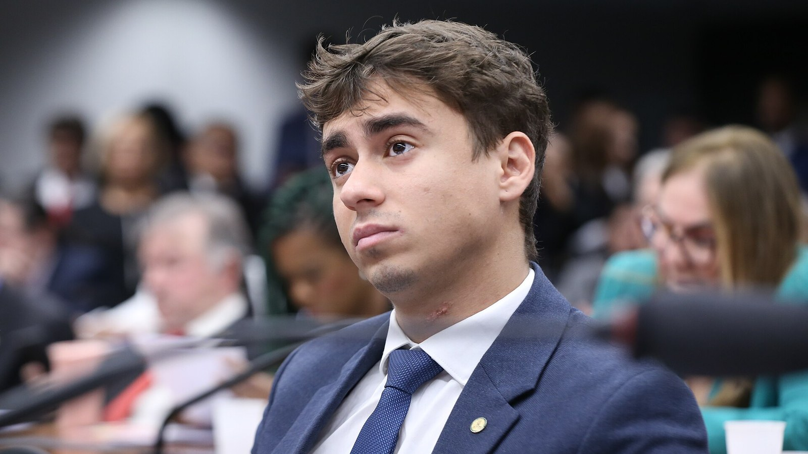
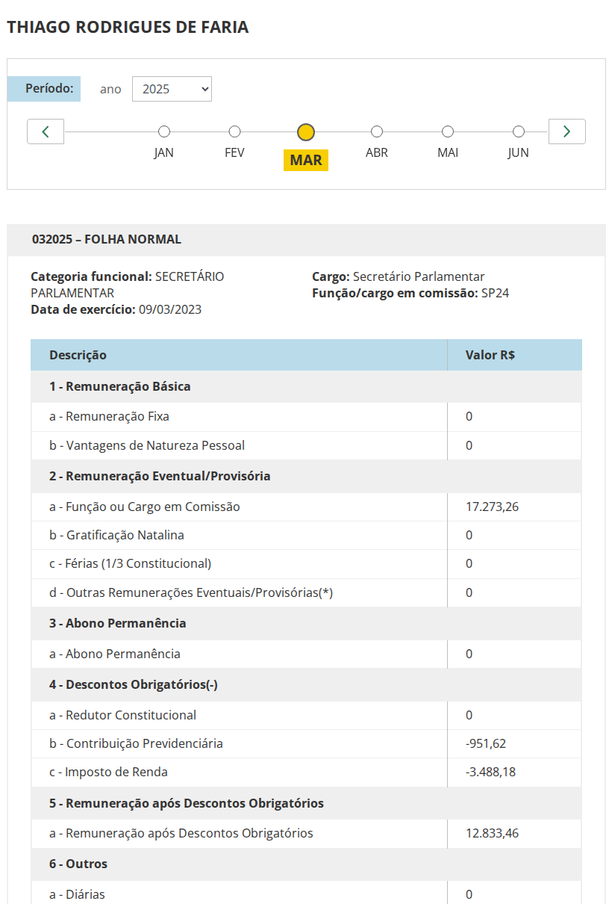
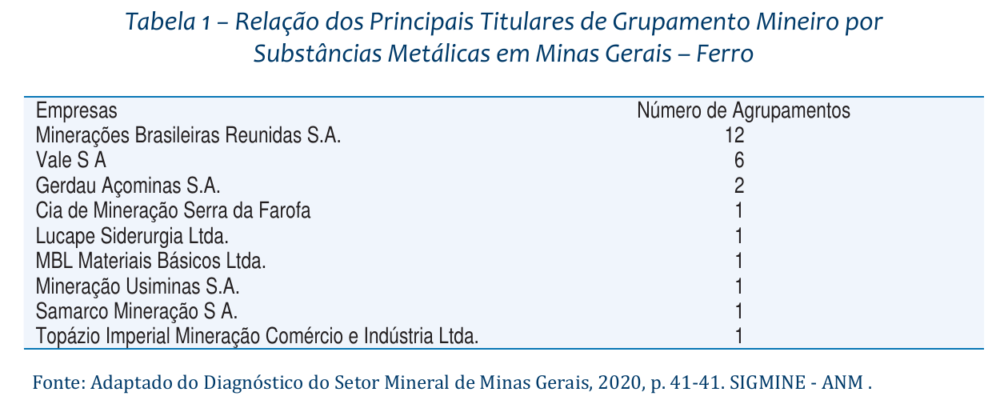
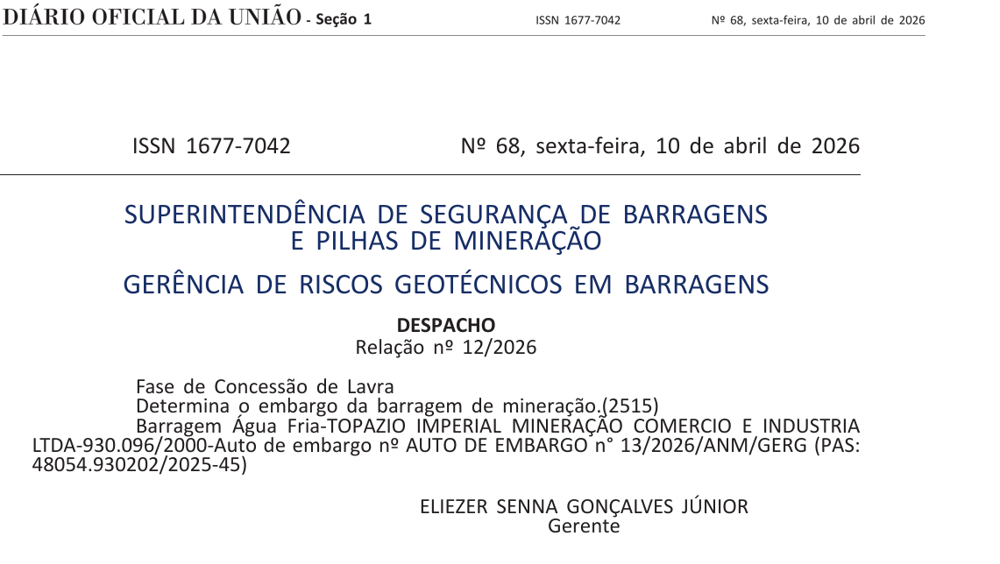
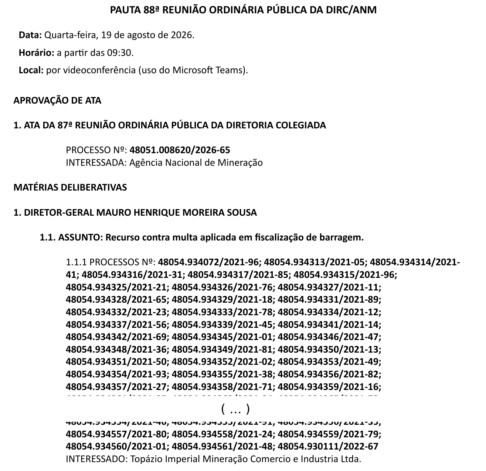

# O assessor de Nikolas recebia R$ 17 mil da Câmara enquanto negociava uma mina de ferro com empresa de fachada da PF

**Registros da Câmara, da Receita e da ANM mostram que Thiago Rodrigues de Faria seguiu no gabinete durante o contrato, o áudio a Vorcaro e a Operação Rejeito. A mineradora do negócio é dona de um dos nove grupamentos de ferro de Minas, com uma barragem embargada em abril.**

*Por Miguel do Rosário. Rascunho de trabalho, 06/09/2026. Não publicado. Pedidos de manifestação ainda não enviados.*

*O deputado Nikolas Ferreira (PL-MG) em audiência pública na Câmara, 21 de maio de 2025. Foto de Kayo Magalhães, Câmara dos Deputados, CC BY 3.0*

---

Nikolas Ferreira chama Thiago Rodrigues de Faria de "ex-assessor". Faria também se apresenta assim. Toda a imprensa repetiu a expressão desde que o ICL revelou o áudio em que o deputado pede a Daniel Vorcaro ajuda para um "ativo minerário" do advogado.

Os registros da Câmara dos Deputados contam outra história. Faria era secretário parlamentar do gabinete de Nikolas quando assinou o contrato minerário, quando o deputado gravou o áudio, quando a Polícia Federal prendeu os donos da empresa com quem ele tinha contrato, e por mais seis meses depois disso.

No mês do áudio, março de 2025, o contracheque dele registrava R$ 17.273,26 de cargo em comissão, mais R$ 2.747,71 de auxílios. Ao longo de 37 meses, o gabinete pagou a Faria mais de R$ 700 mil.

O Cafezinho levantou essas informações no Portal da Transparência da Câmara, na base de dados abertos da Receita Federal e nos cadastros da Agência Nacional de Mineração. Nenhum dos três foi consultado pela cobertura até agora.

## Um funcionário público no meio do negócio

Faria tomou posse em 9 de março de 2023, como secretário parlamentar nível SP24, um dos mais altos da carreira. A ficha funcional dele registra remuneração em todos os meses até março de 2026.

Em janeiro de 2025 o escritório dele assinou um contrato de intermediação com a Gmais Ambiental. O acordo, revelado pelo Estado de Minas com base no inquérito da Operação Rejeito, previa comissão de 20% sobre um negócio de US$ 30 a 45 milhões, a ser dividida entre a Gmais, o escritório de Faria e uma contabilidade chamada Estabil. A parte do advogado poderia chegar a US$ 2,25 milhões.

Faria estava na folha da Câmara naquele mês. Salário de R$ 16.275,56.

Em 30 de março de 2025 Nikolas gravou o áudio para Vorcaro. "Meu advogado, enfim, irmão meu aqui, comentou comigo e falou daqui do seu nome", disse o deputado, antes de explicar que o amigo tinha "um ativo minerário lá, inclusive já passou pela ficha técnica". Faria estava na folha. Salário de R$ 17.273,26.

*Ficha de remuneração de Thiago Rodrigues de Faria em março de 2025, mês do áudio de Nikolas a Vorcaro. Reprodução do Portal da Transparência da Câmara dos Deputados*

Em 17 de setembro de 2025 a Polícia Federal deflagrou a Operação Rejeito e prendeu Rodrigo de Melo Teixeira, ex-superintendente da PF em Minas, e Gilberto Henrique Horta de Carvalho, apontados pelos investigadores como gestores ocultos da Gmais. O nome de Faria apareceu no inquérito. Ele seguiu na folha. Salário de R$ 17.273,26.

Naquele mês, questionado pelo Estado de Minas, Nikolas declarou que o advogado atuava "no exercício de sua atividade privada" e que "o deputado não possui qualquer relação". Faria estava no trigésimo mês como funcionário do gabinete.

Ele só saiu em 30 de março de 2026. Vinte e cinco dias antes, em 5 de março, a PF havia entregue à CPMI do INSS a agenda telefônica de Vorcaro, com o nome de Nikolas e o de Pablo Almeida, ex-chefe de gabinete do deputado e hoje vereador em Belo Horizonte. Foi naquela semana que a relação entre o deputado e o banqueiro virou notícia nacional.

O Cafezinho não afirma que uma coisa causou a outra. Registra as datas.

## A empresa que nasceu dentro do gabinete

Em setembro de 2025 a nota de Nikolas ao Estado de Minas dizia que Faria "atua regularmente como advogado, com escritório registrado". A base da Receita Federal mostra quando esse registro aconteceu.

A Thiago Rodrigues Sociedade Individual de Advocacia, CNPJ 56.902.629/0001-81, foi aberta em 19 de agosto de 2024, com sede em Alphaville, Nova Lima, e capital social de R$ 100 mil. Faria é o titular. Naquele mês ele completava dezoito meses como secretário parlamentar.

A data se encaixa entre dois outros marcos do inquérito. Em abril de 2024, segundo a PF, Faria e Gilberto Horta criaram um grupo de WhatsApp chamado "Projeto Ferro" para tratar da transação. Em janeiro de 2025 o escritório recém-aberto assinou o contrato com a Gmais.

Nova Lima é o município da Serra do Curral onde a Operação Rejeito apurou a extração ilegal de minério de ferro.

O Estatuto da Advocacia permite que um advogado servidor mantenha sociedade unipessoal, desde que não esteja em regime de dedicação exclusiva. O que a lei não responde, e o que o Cafezinho perguntou ao gabinete, é se um secretário parlamentar pode assinar contrato de êxito para intermediar a venda de direitos minerários e receber comissão milionária por isso.

## Que mina é essa

O áudio de Nikolas não diz o nome do ativo. O inquérito da PF diz.

Segundo diálogos interceptados e reproduzidos pelo Estado de Minas em setembro de 2025, o grupo negociava o processo ANM 930.096/2000, um grupamento mineiro da Topázio Imperial Mineração Comércio e Indústria Ltda, no distrito de Rodrigo Silva, em Ouro Preto. A PF registra no relatório que "o empreendimento da Topázio Mineração encontra-se suspenso em razão do ajuizamento pelo MPF da Ação Civil Pública 1000752-23.2023.4.06.3822, com concessão de tutela de urgência pelo Judiciário".

O nome da empresa levou a imprensa a tratar o negócio como uma lavra de topázio, a gema de joalheria que deu fama a Ouro Preto. Os cadastros públicos apontam em outra direção.

No SIGMINE, o sistema de dados abertos da ANM, a Topázio Imperial é titular de dez processos em Minas Gerais. Nove são de topázio ou gema. O décimo, de número 291701/1936, é uma concessão de lavra de minério de ferro com 78,78 hectares, a três quilômetros das minas de topázio. O último evento registrado no cadastro desse processo é de abril de 2007.

Um boletim da FIPE de outubro de 2021, baseado no Diagnóstico do Setor Mineral de Minas Gerais e no SIGMINE, traz uma tabela com os "principais titulares de grupamento mineiro por substâncias metálicas em Minas Gerais, ferro". São nove empresas. Vale, MBR, Gerdau Açominas, Samarco, Usiminas, e, com um grupamento, a Topázio Imperial.

*Tabela do boletim Informações FIPE de outubro de 2021. A Topázio Imperial aparece entre os nove titulares de grupamento mineiro de ferro no estado. Reprodução*

A Topázio Imperial tem um único grupamento na ANM, o 930.096/2000. É o mesmo número que o grupo da Gmais discutia em 2023 e que a PF identifica como objeto do contrato de Faria. É também o número que aparece no Diário Oficial da União de 10 de abril de 2026, quando a ANM determinou o embargo da barragem Água Fria, "fase de concessão de lavra", auto de embargo 13/2026.

*Despacho da ANM no Diário Oficial da União de 10 de abril de 2026 determinando o embargo da barragem Água Fria, vinculada ao processo 930.096/2000 da Topázio Imperial. Reprodução*

Isso não fecha a questão. A composição formal do grupamento só consta no processo da ANM, que o Cafezinho pediu à agência. Mas o conjunto dos registros, o grupo "Projeto Ferro", a concessão de ferro em nome da empresa e a classificação do grupamento pela FIPE, sustenta a pergunta que a cobertura ainda não fez. O "ativo minerário" que Nikolas levou a Vorcaro era uma mina de ferro?

Se for, o negócio de US$ 45 milhões deixa de ser uma gema e passa a ser o mesmo minério que move a Serra do Curral, a Vale e toda a Operação Rejeito.

## O que trava o negócio

A barragem Água Fria acumula 2 milhões de metros cúbicos de rejeito. Foi construída pelo método a montante, o mesmo das estruturas que romperam em Mariana e Brumadinho, e o Ministério Público Federal a listou entre as sete de maior risco de rompimento do país.

Os diálogos do inquérito mostram que o grupo sabia disso. Em 7 de março de 2023 o ex-deputado João Alberto Paixão Lages escreveu a Horta que estava "pegando muito essa questão de assumir os danos da barragem" e sugeriu que "um bom advogado" conversasse com "o Rodrigo". Em 20 de julho de 2023 Horta, ao lado de Teixeira, perguntou a Lages se iriam "ver a barragem".

Vinte e um meses depois dessa conversa, Nikolas ligou para Vorcaro para destravar o ativo.

## O administrador que chegou no meio do caminho

Gilberto Horta não era um estranho para Nikolas. Em 2023 o deputado gravou vídeo pedindo votos para ele na eleição do CREA-MG, "para a gente limpar o sistema de engenheiros de esquerda". Em janeiro de 2025 os dois estiveram na posse de Donald Trump, segundo o Metrópoles.

A base da Receita mostra um dado que a cobertura não registrou. Horta consta como administrador da Gmais Ambiental com data de entrada em 18 de fevereiro de 2025. Um mês depois do contrato com o escritório de Faria. Seis semanas antes do áudio a Vorcaro.

No mesmo mês Horta começou a trabalhar como assessor do vereador Uner Augusto (PL), aliado de Nikolas em Belo Horizonte, cargo que ocupou até ser preso em setembro.

Quando o deputado ligou para o banqueiro, portanto, o advogado do gabinete tinha contrato com uma empresa cujo administrador formal era o mesmo homem que Nikolas apoiara publicamente dois anos antes.

## O regulador

Há um último documento que ajuda a entender o ambiente em que o "destravamento" seria decidido.

Em 26 de dezembro de 2025, três meses depois da Operação Rejeito, a Secretaria-Geral da ANM distribuiu 41 recursos da Topázio Imperial contra multas de fiscalização de barragem. Todos foram sorteados para o mesmo relator, o diretor-geral da agência, Mauro Henrique Moreira Sousa. Em agosto de 2026 a pauta da 88ª reunião da diretoria colegiada já listava 90 recursos da empresa, todos no bloco de Sousa.

*Pauta da 88ª reunião da diretoria colegiada da ANM, 19 de agosto de 2026. Os recursos da Topázio Imperial contra multas de barragem aparecem no bloco do diretor-geral Mauro Sousa. Reprodução do SEI da ANM*

Em 26 de junho de 2026 a Polícia Federal indiciou Mauro Sousa por advocacia administrativa e associação criminosa, no relatório final da Operação Parcours, por manter "canal pessoal e privilegiado" com mineradores investigados na Serra do Curral. A PF trata a Parcours e a Rejeito como investigações conectadas. Sousa continua no cargo. A ANM disse que ele atuou "exclusivamente como representante institucional".

Não há nos documentos qualquer decisão sobre os recursos da Topázio, nem menção a Faria, Nikolas, Gmais ou Banco Master. O que os papéis mostram é que as multas da empresa cuja lavra o grupo queria liberar foram parar nas mãos do dirigente que a PF acusa de proximidade com o setor.

## As defesas

*[Espaço reservado. Perguntas a Nikolas Ferreira, Thiago Rodrigues de Faria, Gmais Ambiental, Topázio Imperial, Estabil e ANM ainda não foram enviadas. Registrar aqui data, canal, prazo e resposta de cada um antes de publicar.]*

Em declarações anteriores, Nikolas afirmou que apenas fez "uma ponte" para um amigo, que não sabia "do que se tratava" e que nunca recebeu dinheiro de Vorcaro. Depois da publicação de A Investigação, enviou áudio ao site dizendo que "o meu advogado queria vender a terra, sei lá o que que era, para o Vorcaro" e que "não houve nada de liberação".

Faria disse ao ICL que trabalha na área de mineração, que "mandou um ativo minerário pra todo mundo" e que nunca foi chamado a depor na PF. Ele não foi indiciado no relatório final da Operação Rejeito.

Vorcaro, por meio da defesa, não se manifesta.

---

Nikolas e Faria têm razão em um ponto. Faria é mesmo um ex-assessor. Desde 30 de março de 2026.

---

## Nota de apuração (não publicar)

Fontes primárias desta reportagem: Portal da Transparência da Câmara (ficha Rw29VM35KZe6WyY8yEb4), base de dados abertos do CNPJ da Receita Federal (via minhareceita.org, consulta em 06/09/2026), SIGMINE/ANM (shapefile MG de 05/09/2026), Certidão SG-ANM 53/2025, Pauta da 88ª ROP da ANM (SEI 20613489), DOU de 10/04/2026 Seção 1 p. 59 (fac-símile hospedado pela ABRAPCH, autenticação na Imprensa Nacional pendente, código 05152026041000059), boletim FIPE bif493 de out/2021.

Fontes secundárias com citação de documento da PF: Estado de Minas (18/09/2025, 03/09/2026), ICL Notícias (03/09/2026), A Investigação (27/05 e 03/09/2026), Metrópoles (set/2025), Poder360 e Observatório da Mineração (jun e jul/2026).

Pendências antes de publicar, em ordem: (1) enviar as perguntas e aguardar 48h; (2) composição do grupamento 930.096/2000 na ANM; (3) autenticar a página do DOU na Imprensa Nacional; (4) ficha da Gmais na JUCEMG; (5) revisar totais do CSV da folha; (6) cruzamento TSE, se render algo. O total de R$ 709.424,03 soma cargo, férias e auxílios de mar/2023 a mar/2026 e exclui o 13º.

Ajustes de linguagem obrigatórios: "empresa de fachada" sempre atribuído à PF; "consta como administrador desde" para Horta; "último evento registrado" para o processo de ferro, nunca "parada desde 2007"; ferro como pergunta até a ANM responder; Mauro Sousa indiciado na Parcours, não na Rejeito.
